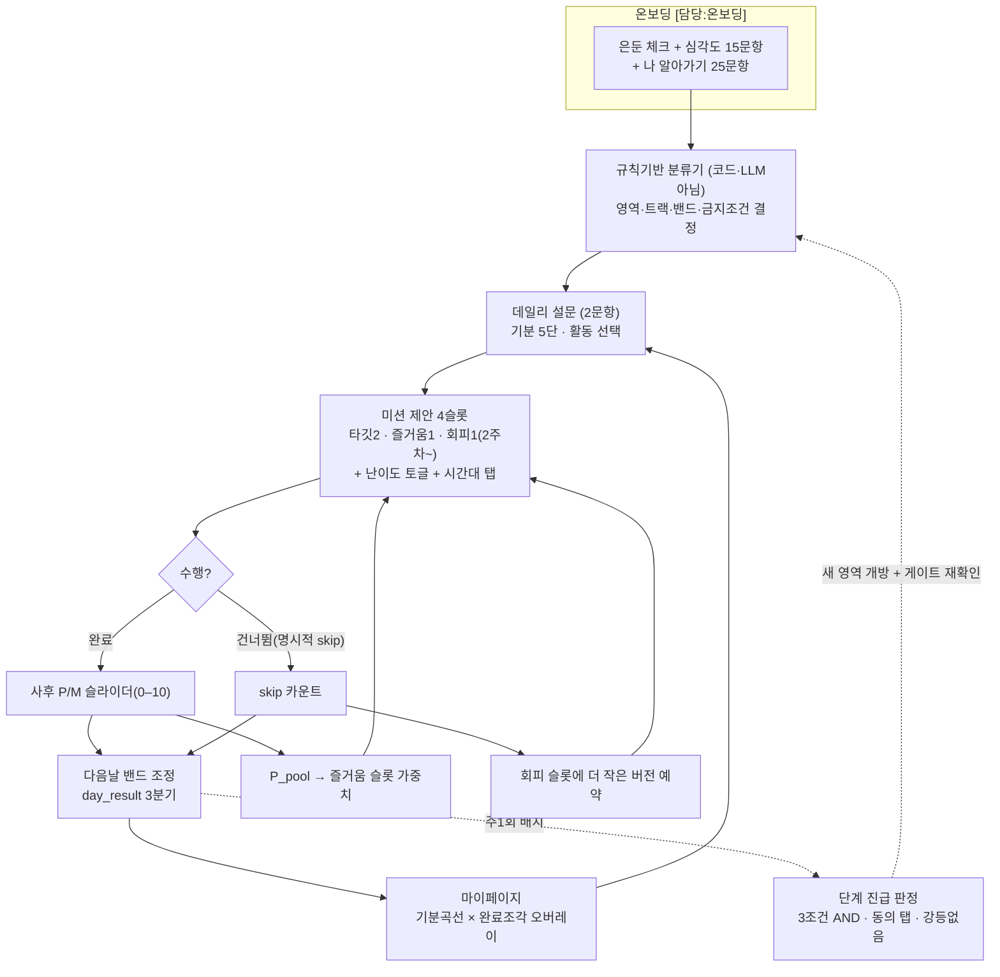
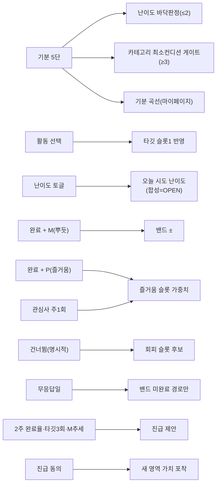
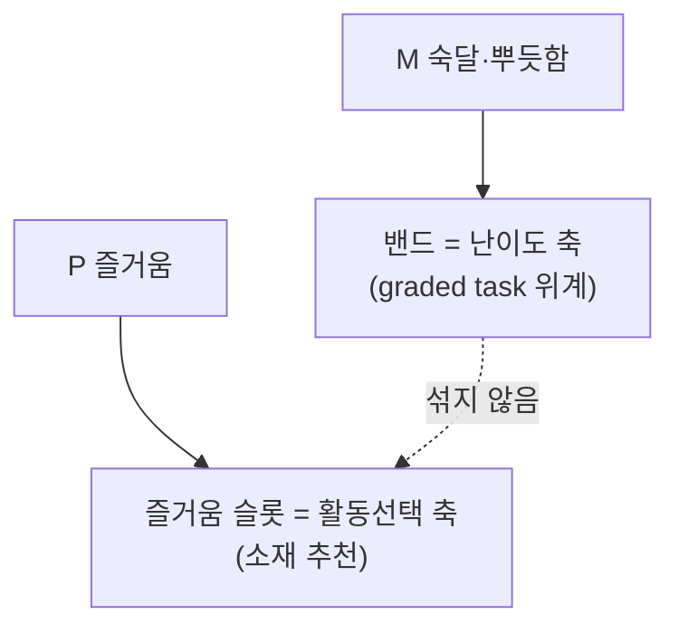

# 조각조각 챌린지 사이클 — 전체 개요 (팀 공유·아카이빙)

_작성: 2026-07-24 · 목적: BA로 재구성한 챌린지 사이클을 팀이 **한눈에 파악·논의**하기 위한 지도. 세부 규칙·복각은 `조각조각_BA사이클_설계명세_v2.md`(v2.2)를 본다._
_읽는 법: §2 흐름도로 큰 그림 → §3 BA 매핑으로 "왜 이렇게" → §4 상태→전이 매핑으로 "규칙끼리 어떻게 물려 있나" → §7 결정 현황으로 회의 안건._

---

## 1. 한 장 요약

- **문제:** 은둔·고립 청년은 "기분 나면 하지"가 안 통한다. 회피가 악순환을 깊게 판다.
- **처방(BA):** 기분이 아니라 **작은 행동을 먼저** 끼워 넣어 작은 보상(햇빛·성취감)을 들이면 기분이 따라 올라온다.
- **재구성 핵심 3가지:**
  1. 랜덤 2슬롯 → **즐거움 슬롯 + 회피 슬롯**(BA 성분 7·8을 실제로 담음).
  2. 부담 이모지 → **난이도 토글(사전) + P/M 슬라이더(사후)**. 그리고 **M→밴드(난이도) / P→즐거움 추천**으로 분리.
  3. 밴드 조정을 **"완료→하향 없음"** 3분기로 재작성 + **주 1회 단계 진급** 레이어 신설.
- **컨셉:** 스토리형(성장형). 규칙은 내부 엔진에만, 사용자는 캐릭터·서사로만 만난다.

---

## 2. 전체 사이클 흐름도

핵심: **매일 도는 루프(데일리→제안→수행→조정→마이페이지)** 위에, **주 1회 진급 레이어**와 **온보딩 시작 데이터**가 얹힌다. 게이트·영역 제약은 어느 단계에서도 완화하지 않는다.

---

## 3. BA 8대 핵심 성분 ↔ 우리 사이클 매핑

_출처: Huguet et al. 2016 (BA core ingredients) + `행동 활성화 리서치.pdf`._

| BA 핵심 성분 | 우리 사이클 위치 | 비고 |
|---|---|---|
| (1) 심리교육(우울/BA) | 온보딩 스토리 카드 | [담당:온보딩] |
| (2) 활동–기분 모델 설명 | 온보딩 + 마이페이지 오버레이 그래프 | 자각을 그래프로 |
| (3) 기분 평정 | 데일리 설문 기분 5단 | 탭 1회 |
| (4) 활동 모니터링 | 완료 기록 + P/M 저장 | 기록과 연결 |
| (5) 즐거움(P) 평정 | 사후 P 슬라이더 | **→ 즐거움 슬롯 구동** |
| (6) 숙달(M) 평정 | 사후 M 슬라이더 | **→ 밴드 구동** |
| (7) 즐거운 활동 스케줄링 | **즐거움 슬롯(3)** | 신설 |
| (8) 회피 활동 스케줄링 | **회피 슬롯(4)** + skip→더 작게 | 신설, TRAP→TRAC |
| +graded task | 밴드 + 토글(가볍게 기본) | 성공확률 최대화 |
| +가치 기반 선택 | 온보딩 가치 + 미션 문구 상기 | 재설문 없음(§5-1) |
| +강화/피드백 | 마이페이지 + 사이클 내 한 줄(가드 조건) | 억지 긍정 금지 |

**정리:** 표준 8성분 + graded/가치/강화를 대부분 채택. "계획"만 의도적으로 최소화(실행 의도 = 시간대/어디서 한 줄).

---

## 4. 상태 → 전이 매핑 (사용자 반응이 무엇을 건드리는가) ★

규칙이 많아 헷갈리는 지점. **"사용자가 이걸 하면 → 어떤 알고리즘·상태가 바뀐다"**를 한 장으로.

**표로 다시 (정확판):**

| 사용자 반응/입력 | 즉시 영향 | 다음날/주 영향 | 규칙 위치 |
|---|---|---|---|
| 기분 5단 | 바닥판정(≤2)·카테고리 게이트(≥3) | 기분 곡선 baseline 대비 | §5, §4-2 |
| 활동 선택(activityId) | 타깃 슬롯1에 반영 | — | §5 |
| 난이도 토글 | 오늘 시도 난이도(합성 **OPEN**) | — | §7-1 |
| **완료 + M 높음(+도전)** | 축하 | **밴드 +1** | §7-3 |
| 완료 + M 낮음(연속2) | 위로 | 토글 기본 '가볍게' 복귀 | §7-3 |
| **완료 + P 높음** | — | 즐거움 슬롯 소재 가중치↑ | §7-3 |
| 즐거움/회피만 완료 | 완료 축하 | 밴드 **유지**(미완료 아님) | §7-3 |
| 완전 미완료 | — | 밴드 −1, 회피 예약 | §7-3 |
| 2일 연속 미완료 | 위로 | L1 리셋 | §7-3 |
| 명시적 skip(2주 2회) | — | 회피 슬롯 후보 | §6-1,6-4 |
| 무응답일 | — | 밴드 미완료엔 포함, 회피엔 제외 | §6-4 |
| 2주 완료율·타깃3회·M추세 | — | **진급 제안**(동의 탭) | §8 |
| 관심사 주1회 갱신 | — | 즐거움 슬롯 소재 | §5-1 |
| 진급 동의 | 새 영역 게이트 재확인 | 새 영역 가치 포착 | §8, §5-1 |

**불변식 두 개(항상 성립):** ① **완료(어떤 형태든)→밴드 하향 없음** — 하향은 완전 미완료에서만. ② **게이트·영역 제약은 절대 완화 안 함**(다양성만 완화).

---

## 5. 두 적응 레이어 (핵심 구조)

M과 P를 **한 표에 섞지 않는다.** 이 분리가 조정표를 단순하게 만들고, "완료→하향 없음"을 성립시키고, 콜드스타트·노브 이중화를 동시에 푼다.

---

## 6. 밴드 조정(day_result 3분기) — 요약

| day_result | 조건 | ΔB |
|---|---|---|
| 완료 | 타깃 슬롯 ≥1 완료 | M·토글 따라 +1 / 0 |
| 유지 | 즐거움·회피만 완료 | **0** |
| 미완료 | 아무것도 완료 안 함 | −1 (2일 연속 → L1 리셋) |

- M 높음+도전=+1, M 낮음=위로, 하향은 미완료에서만. `nudge_streak`/`low_m_streak`은 내부 전용.
- 상세표: 명세 §7-3.

---

## 7. 결정 현황 (회의 논의용)

**✅ 확정(SETTLED):** 슬롯 4구성(즐거움/회피) · P/M 0–10 슬라이더→5구간 · M→밴드/P→즐거움 분리 · day_result 3분기 · 진급 3조건 AND(보수적)·강등없음 · 게이트 4주 재평가 · 컨셉 스토리형 · 계획 1층(실행의도)·2층 현행유지 · 가치 재설문 없음(§5-1) · 리마인더 골격(시작큐+저녁 체크인) · **회피 슬롯 접근·긍정 프레이밍 가드**(§6-8b).

**🟡 승인 필요 / OPEN(회의):**

| # | 안건 | 선택지 |
|---|---|---|
| 0 | **난이도 합성(명세 §7-1)** | A 합산 / B 계획우선 / C 안전우선 (컨디션 바닥 −1 포함) |
| 4 | **리마인더 강도(§6-7)** | 시작큐만 / 시작큐+저녁 체크인(추천) / 미션별 2회 |
| 4b | **회피 사유 탭(2층)** | 채택 / 보류(현행) |
| 4c | **주간 계획(3층)** | 없음 / 비위험군 선택형 / 스토리 "이번 화 목표" |
| 4e | **계획량 grade-down(§6-8c)** ★ | 은둔 초기 실제 실행 1개→최대3, 4슬롯 "메뉴" vs 약속 수 분리 |
| 4f | 저단계 빈도 기반 계획(§6-8d) | "오늘 한 번" vs 시간대 지정 |
| 4g | 상상 유도 프롬프트(§6-8a) | 채택(추천) / 보류 — 저부담·고효과 |
| 4h | 기대 쾌감 0–10(§6-8f) | 추가 입력 vs 추천 정확도 |
| 그외 | 위기신호 UX(임상) · diversity_key 라벨링 · 회피 재축소 하한 · 기관 대시보드 동의 · 완료율 분모 | 명세 §10 |

---

## 8. 문서 맵 (어디에 뭐가 있나)

| 문서 | 내용 |
|---|---|
| `조각조각_BA사이클_설계명세_v2.md` (v2.3) | **복각용 단일 명세** — 모든 규칙·의사코드·SETTLED/OPEN |
| `온보딩_설계_Part1-2.md` | 온보딩 설문 전문(17문항+25문항·채점·게이트) [담당:온보딩] |
| `조각조각_사이클_전체개요_팀공유.md` (이 문서) | 팀 공유용 지도 — 흐름도·BA매핑·전이맵·결정현황 |
| `BA_앱_레퍼런스_비교.md` | BA/셀프케어 앱 사례 비교(B-ACT·Moodivate·Finch 등) |
| `협업_매뉴얼_GitHub_초보자용.md` | 팀 GitHub 협업 매뉴얼(Mac/Win) |
| `character_reward_design.md` | 캐릭터·뱃지·보상(넛징 재설계 예정, 최소 참고) |
| `mission-bank-v2.md` / `미션뱅크_DB_심화판.md` | 미션 시드 DB |
| `0720_알고리즘_v2_BA사이클.md`, `algorithm.md` | v2·v1 알고리즘 원본 |
